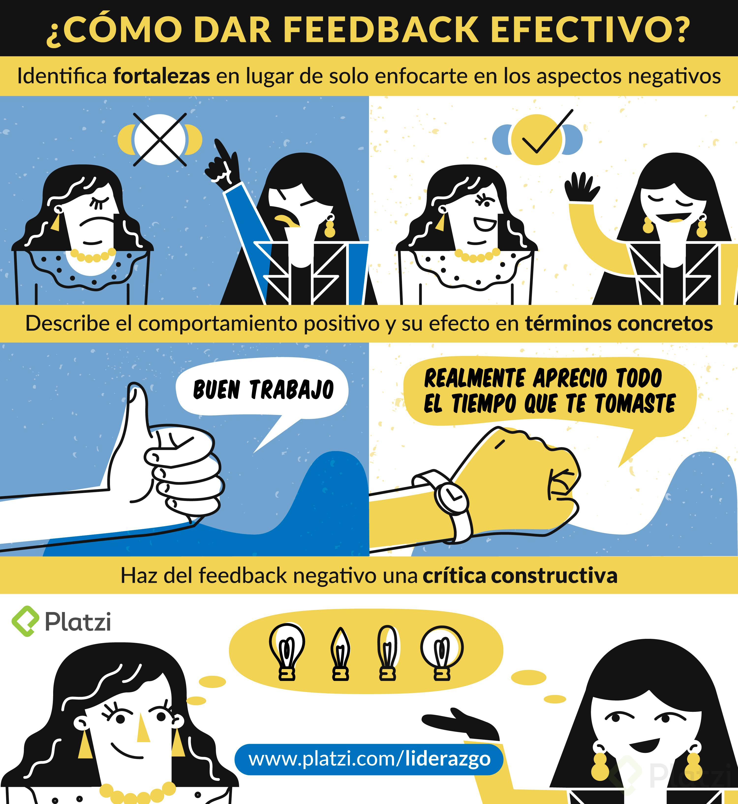

# Liderazgo

## ¿Jefe y líder es lo mismo?

**Gerenciar**: Resuelve problemas técnicos, procura que las cosas se hagan bien. 
- Planea, presupuesta, estructura planes de trabajo, perfiles de cargo para tomar decisiones.
- Atiende el pasado y presente de la organización.

**Jefe**: Lo elige la empresa, ejerce mando o control.

**Líder**: Resuelve problemas sociales, hace que las cosas pasen. 
- Atiende el presente y el futuro.
- Lo elige su equipo, genera influencia
- **Hace que las cosas pasen por medio de otras personas**

## Modelos de Liderazgo
---
### Supuestos

Los emprendimientos pueden verse como seres vivientes:
El liderazgo es un acto de conversación
El estilo de liderazgo esta influenciado según el contexto.
Modelos de Liderazgo:

>“Liderazgo es la capacidad de traducir la visión en realidad” - Warren Bennis.

### 7 atributos de este liderazgo:

- **Competencia técnica**: Conocimiento del area
- **Habilidad Conceptual**: capacidad de pensamiento abstracto
- **Historia**
- **Habilidades interpersonales**: habilidad de comunicar, motivar
- **Identificación de talentos**: capacidad de ver potencial
- **Criterio**: Toman decisiones difíciles en corto tiempo
- **Carácter**

### Líder de principios de <cite>Stephen Covey</cite>

>“El liderazgo consige transmitir a las personas su valor, y así la persona se reconoce como valiosa”

>"Liderazgo efectivo es poner las primeras cosas, primero. Gestion efectiva es disiplina, ejecutar."
### Analisis del ser dividido en 4 dimensiones.
**Cuerpo, Mente, Corazón, Espíritu**

-Que es lo que necesito para desarrollarme como lider
- Atender necesidades
- Desarrollar inteligencias
- Cultivar Atributos
- Conocer nuestra voz

Analizar el Ser | Atender Necesidades | Desarrollar Inteligencias | Cultivar Atributos | Conocer Nuestra voz
:------: | :------: | :--------: | :--------: | :------: |
Cuerpo | Placer/Sentir | Física | Disiplina | Necesidad
Mente: | Aprender | Metal/Intelectual | Visión | Talento
Corazón | Amar | Emocional | Pasión | Pasion y Moral
Espíritu | Dejar Legado | Espiritual | Conciencia | Pasión y moral

>“Pasar de la **dependencia** a la **independencia** y de esta a la **interdependencia**”

## Líder servidor de talento, carismático y líder de cambio
---
### Líder servidor de talento

 >“El arte de liderazgo recae en pulir, liberar y permitir la variedad de talentos que las personas traen” Max De Pree.
- Integridad en su comportamiento
- Confianza en las habilidades y el esfuerzo de los demás
- Discernimiento con criterio
- Coraje en las relaciones para las decisiones difíciles y actuar con honestidad
- Humor con perspectiva amplia de la experiencia humana
- Energía intelectual para aprender continuamente
- Amplitud de visión para abarcar a muchos
- Comodidad con la ambigüedad y darle sentido al caos
- Presencia para contestar preguntas, escuchar y hacer seguimiento
  
### Carismático 

>“Los lideres inspiran a las personas con una visión clara de como las cosas pueden hacerse mejor” Jack Welch & Noel Tichy.

- Ven la realidad, primero en sí mismos
- Tienen energía y energizan a otros – mucha emoción
- Desafían el Statu Quo
- Conocen y actúan sobre el propósito de la organización
- Realizan elecciones duras y toman acciones difíciles – tienen “empuje”
- Son ejemplo: enseñan a otros a ser lideres con su actuar
  
### Líder del cambio: 
>“Un buen liderazgo no significa escaparle a la realidad. A veces, las realidades difíciles inspiran a las personas a actuar” John Kotter

|  | Foco | Liderazgo requerido | Atributos
| --- | :----:| :----: | :----: |
| Poco Cambio | Productos y procesos con ciclos de vida largos | Buena Gestión | Planificación, sistemas, estructuras, personal y controles |
| Mejora Continua | Cambios Graduales y constantes | Excelente Gestión | Cultura del Aprendizaje |
| Cambio no gradual | Introducción regular de nuevas maneras de hacer las cosas | Liderazgo visionario | Visión sensata, alineación de las personas y gente motivada al logro | 
| Negocios totalmente nuevos | Nuevos productos y negocios | Liderazgo que libera energía | Energía apoyo en los sueños de la gente, valores y sentidos | 
| Nuevos Modelos de Negocios | Inventar nuevos negocios, nuevos modelos económicos y organizacionales | Liderazgo Transformador | Crea grupos de trabajo ambiciosos con resultados asombrosos (radical) | 

## Las 3 dimensiones del liderazgo de alto desempeño

- Todo empieza por uno (Liderazgo de unos mismo) - Autoconocimiento (Fortalezas / Debilidades)
- Pero no soy el protagonismo (Liderazgo de mi equipo) - Se debe ser el guía con los demás
- Son los demás: las personas, el negocio y la empresa (Liderar a líderes)

## ¿Por qué primero yo?

Debemos recordar que el liderazgo no nace, se hace y es un camino arduo donde se observará aciertos/errores y que nos ayudaran en el aprendizaje.

>“Influenciar o dominar a los demás es una fortaleza, pero dominarse a si mismo es ser poderoso” <cite>Lao Tzu</cite>

## El propósito personal

El **para qué**, me impulsa hacia el futuro y me inspira. Pero el **porqué** me lleva a hacer las cosas hoy, me levanta de la cama para ir a hacer lo que me va a llevar a mi **para qué**. Por eso es muy importante tener cada uno definido.

## Grandes propósitos, resultados extraordinarios

### Nelson Mandela
>“Soy el amo de mi destino, soy el capitán de mi alma” <cite>William E. Henley.</cite>
### Viktor FrankI
>“Los que tenían un motivo para sobrevivir fueron los que sobrevivieron”
### Sobrevivientes de los Andes
>“Tenias tantas ganas de salir de ahí que emanabase ese sentimiento de seguridad”
### Walt Disney
>“Crear felicidad”
### Pedro Tarak Empresas B
>Tiene un propósito ambiental, social o cultural. Las empresas B no aspiran a ser las mejores del mundo, sino a ser “las mejores para el mundo”
### Freddy y Cris Platzi
>Revolucionar la forma como nos educamos en nuestra vida.

## Líder Emocional

>¿Cuáles son esas competencias que hacen la diferencia en el desempeño de varias personas? <cite>Daniel Goleman</cite>

### Competencias de liderazgo emocional

- Conocimiento de uno mismo (capacidad de reconocer nuestras propias emociones, de saber que está pasando internamente conmigo)
  
### ¿Cuáles son mis puntos fuertes y débiles en mi desempeño?, 
¿En que soy bueno y en que no? Pedir ayuda cuando me enfrento a algo que no se hacer. La representamos con la película de Invictus.
  
### ¿Cómo identificar a un líder que tiene desarrollado el autorreconocimiento?
  - Autogestión (dominio de si mismo) La representamos con la película de Intensamente
  
  - La empatía (relación con los demás o entender la posición del otro) la relacionamos con la película Mejor imposible.
  
  - Habilidades sociales (importante para el trabajo en equipo) La relacionamos con la película Jerry Maguire.

## La agenda semanal

Es importante entender que el uso del tiempo tiene mucho que ver con el alineamiento de las tareas en las que **gastas** el tiempo con el propósito que buscas en tu día a día y mucho más con el propósito general en tu vida laboral y personal.

Para eso te planteamos el siguiente ejercicio bien práctico para que luego lo integres a tus hábitos semanales.

- Identifica los roles que cumples en tu vida. Por ej: empresario, profesional, padre, hermana, amigo, etc.

- Escribe 3 objetivos para cumplir esta semana en cada uno de los roles
- Planifica tu semana. Utiliza la grilla que representa una semana, dibuja espacios donde dedicarás tiempo a cada objetivo.
- Uso del tiempo ideal:
    - Descansar y hacer ejercicio
    - Trabajar y estudiar
    - Hobby / Reunión de amigos y familia
    - Meditación y contemplación
- Uso del tiempo Real:
    - Descansar y hacer ejercicio
    - Trabajar y estudiar (demanda mucho más tiempo)
    - Hobby / Reunión de amigos y familia
    - Meditación y contemplación
- El método de la Agenda semanal (Pirámide - se lee desde la base)
    - Ejecutar
    - Planificar a diario
    - Planificar la semana
    - Fijar objetivos
    - Identificar tus propósitos y valores
  
- Objetivos por Roles.
    - Rol. Objetivo
        - Ej. Programador web Ej. Terminar con el website de e-commerce
        -Ej. Amiga – hermano -jugador de Ej. Organizar una salida con las amigas de de la universidad.
    - Rol 1: 
        - Meta 1:
        - Meta 2:
        - Meta 3:
   - Rol 2: 
        - Meta 1:
        - Meta 2:
        - Meta 3:
   - Rol 3: 
        - Meta 1:
        - Meta 2:
        - Meta 3:
  
## Armar Equipo
Se deben responder las siguientes preguntas.
- ¿Qué capacidades tienen las personas?
- ¿Qué comportamientos vemos?
- ¿Qué compromiso hay?

### Equipo de alto desempeño
>“Reducido numero de personas con habilidades complementarias, comprometidas con una forma de trabajo acordada y un objetivo en común por el cual todos se responsabilizan” Katzenbach & Smith The Wisdom of Teams

- Reducido número de personas
- Habilidades complementarias
- Forma de trabajo acordada
- Objetivo en común
- Responsabilidad compartida
### Definiendo el propósito de mi equipo

- ¿Cuál es el propósito de su equipo de trabajo?
- ¿Qué es lo que los une?
- ¿A quiénes están sirviendo?
- ¿A quién entregan valor?

## ¿Cómo liderar a personas y equipos?

Los lideres tienen que lograr motivar, planteando desafíos claros y que genere a las personas de su equipo, la capacidad de enfrentar ese desafió y que ellos mismos vean que pueden hacerlo, pero que a la vez les exijan. 

## Liderazgo Situacional
### Habilidad de liderar

Tomar decisiones sobre dilemas que se presentan a diario
#### Dilemas
- ¿Personas o tareas?
- ¿Delegar o no?
- ¿Exponer los temas o cerrar trinchera?
- ¿Estilo formal o informal?
- ¿Cambios graduales o radicales?
#### Estilo directivo
- Asume toda la responsabilidad de la toma de decisiones (le cuesta delegar)
- Solo el/ella es competente y capaz de tomar decisiones importantes.
- Las personas son incapaces de guiarse a sí mismos con posición de fuerza y control.
-	Lo que espera de las personas a su cargo es obediencia y adhesión a sus decisiones.
#### Estilo participativo
-	Toma de decisiones en consulta. No delega su derecho a tomar decisiones finales.
-	Escucha y analiza las ideas de los demás y acepta sus contribuciones siempre que sea posible y practico.
-	Fomenta la toma de decisiones de los demás y el trabajo en equipo para lograr mejores resultados.
-	Impulsa a las personas a incrementar su capacidad de auto control. Los apoya.

El desempeño se logra por dos variables: Alta o baja motivación

- Por la motivación que tiene la persona de hacerlo
- Por la competencia que tienen de lograrlo
  
#### Dirigir 
- Cuando la motivación es baja y las personas no tienen la capacidad.

#### Instruir
- Motivada, pero le falta capacidad.
#### Apoyar 
- Competencia sube, pero competencia baja (buscar causas emocionales)
#### Delegar 
- Muy motivada y muy competente.

|Motivación|Competencia| Mejor opción|
|:----------:|:-----------:|:-------------:|
|Motivación Baja|Poco competente|Dirigir
|Motivación Alta|Poco competente|Instruir
|Motivación Baja|Muy competente|Apoyar
|Motivación Alta|Muy competente|Delegar

### Matriz de ejemplo de Liderazgo Situacional

<table style="text-align: center">
    <thead>
        <tr>
            <th colspan=2 class="centrado">Colaborador a Cargo</th>
            <th colspan=2 class="centrado">Líder</th>
        </tr>
        <tr>
            <th class="centrado">Competencia</th>
            <th class="centrado">Buena Disposición</th>
            <th class="centrado">Comportamiento Directo</th>
            <th class="centrado">Comportamiento de Apoyo</th>
        </tr>
    </thead>
    <tbody>
        <tr>
            <td>No sabe cómo hacer la tarea</td>
            <td>Siente que puede hacer la tarea</td>
            <td>Alto</td>
            <td>Bajo</td>
        </tr>
        <tr>
            <td>No sabe cómo hacer la tarea</td>
            <td>No entiende porqué tiene que hacer la tarea</td>
            <td>Alto</td>
            <td>Alto (explicar el porqué)</td>
        </tr>
        <tr>
            <td>No sabe cómo hacer la tarea</td>
            <td>Siente que puede hacer la tarea</td>
            <td>Alto</td>
            <td>Alto (socio - emocional)</td>
        </tr>
        <tr>
            <td>Puede hacer la tarea razonablemente bien</td>
            <td>Desea demostrar su competencia o busca re - asegurarla</td>
            <td>Bajo</td>
            <td>Alto (participar)</td>
        </tr>
        <tr>
            <td>Experto</td>
            <td>Siente que no es necesario hacer la tarea o que debe hacerse de otra manera</td>
            <td>Bajo</td>
            <td>Alto (escuchar dar feedback reconocimiento</td>
        </tr>
        <tr>
            <td>Experto</td>
            <td>Altamente motivado</td>
            <td>Bajo</td>
            <td>Bajo</td>
        </tr>
    </tbody>
</table>

## Definir metas

1. Tener la capacidad de poner en blanco y negro lo que se espera de cada persona
2. tener un grado de compromiso y responsabilidad
3. Medir el desempeño de cada meta de equipo o de cada persona

### Técnica SMART
- Specific: No hay ambigüedad
- Measurable: Debemos tener un elemento de medición
- Achievable: La meta debe ser alcanzable pero no cómoda
- Realistic
- Timed: definir el tiempo limite, porque sin tiempo, es un sueño no una meta

### Ejemplo

| Meta | Definicion del indicador | Valor inicial | Valor final | Plazo o fecha límite |
|:------:|:-------------------------:|:--------------:|:--------------:|:--------------:|
| Ej: Mejorar la usabilidad del Front-end | % de satisfacción | 50% | 75% | 1 mes / 15 de junio | 

## Desarrollar a las personas
- Compartir información
- Entender la situación
- Promover la responsabilidad
- Apropiarse de los procesos
  
### Delegar como herramienta de desarrollo
- Recurrir a su experiencia
- Brindar información
- Revisar recursos disponibles
- Notificar a los demás
- Concentrarse en los resultados
  
>“La delegación requiere la voluntad de aceptar errores en el corto plazo para ganar capacidades a largo plazo” <cite>Dave Ramsey</cite>

## Reconocer el desempeño
- ¿Cómo reconocer lo que está bien hecho? Mirar también lo que no se hizo bien.
- ¿Qué tipo de reconocimiento es más efectivo?
- ¿Qué tipo de recompensas hay que dar de acuerdo con lo que vamos haciendo?
- ¿Cuál es la mejor recompensa?
    - Intrínseca (felicitaciones por el buen trabajo realizado)
    - Extrínseca (bono o pago extra)
- ¿Qué reconocer?
  - Cumplimiento de la meta planteada
  - Conclusión de un proyecto
  - Lograr destrabar un conflicto
  - El resultado de aplicar una idea con ingenio y creatividad
  - ¡Actividades! Responsabilidad, respeto.
  - ¡Valores! (enunciados que dicen como se hacen las cosas)
  
### Existen dos tipos de reconocimiento:

- Reconocimiento intelectual (proceso de evaluación del desempeño organizacional)
    - Feedback formal e informal (al momento de terminar un ciclo de desempeño y reconocimiento diario)
    - Estrategia 3c (forma de reconocimiento definiendo un contexto donde sucedió esa actividad, que comportamiento tuvo la persona y consecuencia de tomar esa decisión)
    - Feedback efectivo (algunas consideraciones al momento de hacer el reconocimiento formal)
- Reconocimiento emocional
  - Energía emocional positiva
  - ¿Se pueden reconocer intenciones?
  - Reconocer la exigencia
>“Se dan los dos reconocimientos”

>“El reconocimiento emocional es el motor”

>“Hay que ser exigentes para ser excelentes en el servicio”
>- Exigencia: dar lo máximo de mí
>- Excelencia: caminar hacia lo mejor posible
>- Servicio: nuestro propósito de hacer las cosas

## Contexto / Comportamiento / Consecuencia

### Feedback efectivo: La 3c

El feedback como proceso de reconocer el desempeño debe ser siempre en la clave constructiva (mirar hacia delante) y firme. ¡No son excluyentes!
-   Contexto
-   Comportamiento
-   Consecuencia

### Ejemplo no 3c
> Camila, la verdad me has defraudado, no encuentro motivos para reconocer tu trabajo. ¡Esperaba mucho más de ti!

### Ejemplo semi 3c

#### Contexto 
> Camila en la reunión de hoy ...

#### Comportamiento
>... creo que en algún momento alguna idea tuviste, pero la verdad me parece que nadie te escuchó...

#### Consecuencia
>... o levantas la voz la proxima vez o no tiene sentido que vengas...

### Ejemplo 3c
#### Contexto 
> Camila en la reunión de hoy ...

#### Comportamiento
>... hiciste buenas contribuciones, pero tu voz era un poco baja, silenciosa.

#### Consecuencia
>... y no podía oirte muy bien, por lo que necesitas elevar tu voz un poco en el futuro. ¿Porqué piensas que ocurre sucede esto?

- **Haz feedback sobre el comportamiento de una persona, no sobre la persona misma**. Haz descripciones precisas de la conducta, no comentarios sobre las cualidades y el valor de la persona como un individuo: “Has tardado mucho en llegar al trabajo en el último mes” en lugar de: “Eres perezoso”

- **No dejes pasar mucho tiempo entre la acción y el momento para dar feedback**. Cuanto más tiempo pasa, más irrelevante se vuelve hacerlo.

- **Sé directo y honesto**. No te extiendas en introducciones, pero recuerda comenzar con un elogio genuino basado en lo que la persona hizo bien.

- **Hacer el feedback en privado sí es posible**, a veces puede ser insensible hacer esto delante de otros.

- **Tratar un tema a la vez**. Utiliza las 3c del feedback.

- **Recuerda no repetir el mismo punto una y otra vez**: esto solo generará resentimiento.

- **Critica asertivamente los comportamientos que se pueden cambiar**, por ejemplo, “Necesitas mejorar tus habilidades informáticas” en lugar de “¡Eres estúpido!”

- **No compares a una persona con otras personas**, ya que esto puede generar celos y mal ambiente, además de ser una actitud injusta.

- **Mantén tus emociones bajo control**. Es común sentirse afectado porque puede darse un momento de conflicto al dar feedback y las emociones pueden “nublar” el objetivo de la conversación.

- **Al finalizar asegúrate de que te hayan entendido bien**. Re-chequea que es así una y otra vez si es necesario.

## Conclusiones 👏

- No se trata de ti, se trata de los demás
- El acto de liderazgo es una actividad completamente al servicio de las personas de tu organización
- Para liderar a las personas debes aprender de ti mismo y liderarte
- Aprende de inteligencia emocional para tratar a las personas. Esto es importante para dar Feedback en varias situaciones
- >“Sin un para qué, no tengo un por qué.”
- Revisa a diario la ejecución de tus tareas y que paso por tu cabeza mientras las realizabas
- Define metas SMART
- Aprender a desarrollar a las personas y a tu equipo

